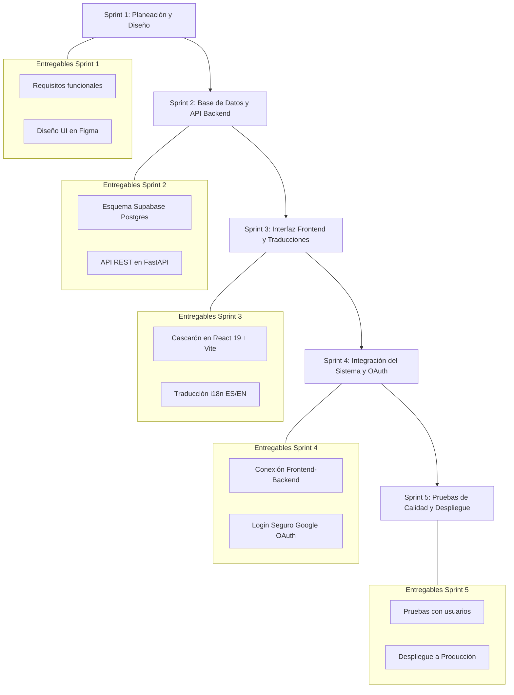
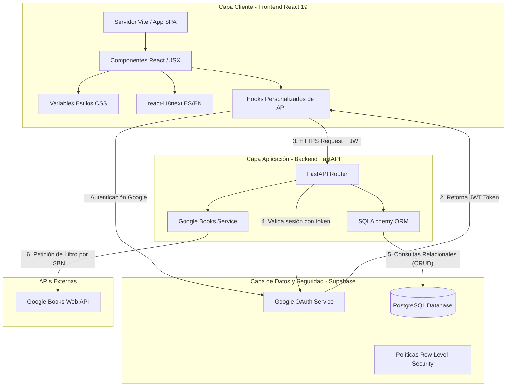
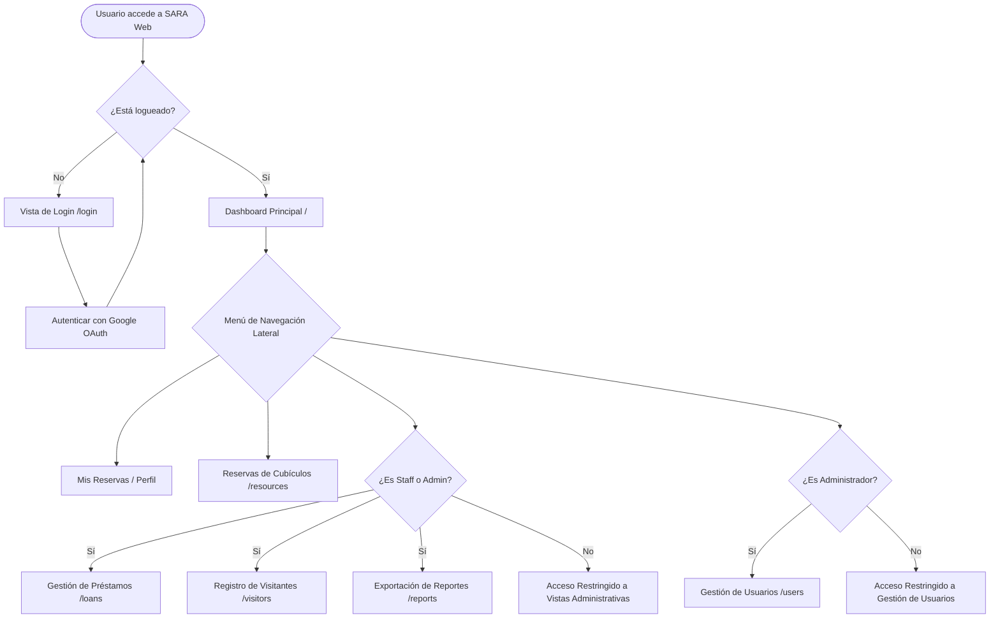
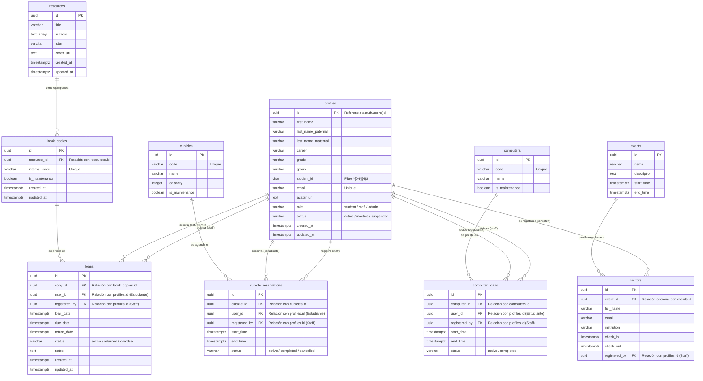

# Diagramas del Proyecto S.A.R.A. (Códigos Mermaid)

Este documento contiene los códigos fuente en formato **Mermaid** para generar todos los diagramas y figuras del proyecto **S.A.R.A. (Sistema de Acceso y Registro Automatizado)**.

### **¿Cómo utilizar estos códigos?**
1. **Mermaid Live Editor (Recomendado):** Ingresa a [https://mermaid.live/](https://mermaid.live/), pega el bloque de código del diagrama de tu elección y podrás previsualizarlo e inmediatamente exportarlo como imagen (**PNG, SVG o PDF**) para insertarlo en tu documento de Google Docs o Word.
2. **Visual Studio Code:** Si usas VS Code, puedes instalar la extensión **"Markdown Preview Mermaid Support"** para ver los diagramas renderizados directamente en el editor.
3. **Alternativas de Dibujo (Manual):** Si prefieres dibujar o personalizar los diagramas manualmente con interfaces de arrastrar y soltar, te sugerimos utilizar **Figma** (diseño vectorial moderno) o **Draw.io / Lucidchart** (ideal para diagramas relacionales e institucionales).

---

## 1. Metodología Scrum (Sprints de S.A.R.A.)
- **Corresponde a:** **Imagen 2: Diagrama de la metodología Scrum.jpg** (Sección 2.6 del documento principal)
- **Descripción:** Representa el ciclo de Scrum del proyecto y los entregables clave de cada sprint.



---

## 2. Arquitectura de S.A.R.A. (Nivel de Componentes y Flujo)
- **Corresponde a:** **Imagen 6: Flowchart de Arquitectura SARA.jpg** (Sección 10.1 del documento principal)
- **Descripción:** Esquematiza la comunicación cliente-servidor-base de datos con consumo de Google Books API.



---

## 3. Diagrama de Navegación del Sitio (Rutas del Frontend)
- **Corresponde a:** **Imagen 7: Diagrama de Rutas y Navegación de SARA.jpg** (Sección 10.2 del documento principal)
- **Descripción:** Muestra el flujo de navegación del usuario, la restricción de login y vistas asignadas según el rol.



---

## 4. Diagrama Entidad-Relación de la Base de Datos SARA
- **Corresponde a:** **Imagen 8: Diagrama Entidad-Relación de Base de Datos SARA.jpg** (Sección 10.3 del documento principal)
- **Descripción:** Refleja la estructura física e integridad referencial de las tablas creadas en Supabase PostgreSQL.



---

## 5. Cronograma del Proyecto (Diagrama de Gantt)
- **Corresponde a:** **Imagen 9: Diagrama de Gantt del Cronograma SARA.jpg** (Sección 10.4 del documento principal)
- **Descripción:** Calendarización de las fases del proyecto por sprints de desarrollo.

```mermaid
gantt
    title Cronograma de Desarrollo S.A.R.A.
    dateFormat  YYYY-MM-DD
    section Sprints de Desarrollo
    Sprint 1: Planeación y Diseño de Interfaz (Figma)      :active, s1, 2026-08-10, 2026-09-06
    Sprint 2: Configuración de Base de Datos y API Backend  : s2, 2026-09-07, 2026-10-04
    Sprint 3: Construcción Frontend (React) e i18n         : s3, 2026-10-05, 2026-11-01
    Sprint 4: Integración del Sistema y Google OAuth        : s4, 2026-11-02, 2026-11-22
    Sprint 5: Pruebas de Calidad, Validación y Despliegue  : s5, 2026-11-23, 2026-12-14
```
